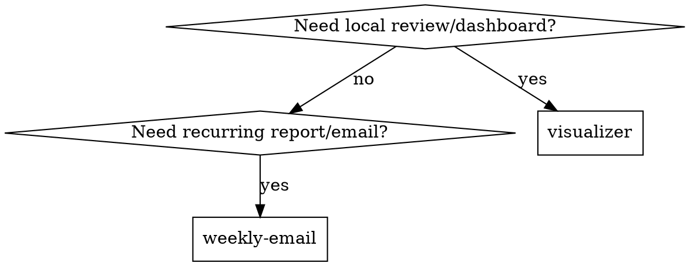

# Literature Radar Hub

## Overview

<!-- //============XJQ(本次修改：保留旧的单模式入口说明，改为并列多选能力入口；以下旧文本仅供审计，禁止执行)====================//
DEPRECATED HISTORICAL TEXT — do not follow this commented-out single-mode rule.
Use one entry point for four installed capabilities: `nature-academic-search`,
`daily-literature-digest`, `paper-vault` (the local implementation of the
research-radar-paper-vault workflow), and `zotero-literature-visualizer`.
Choose exactly one mode per request:

| User goal | Mode | Main outputs |
|---|---|---|
| Chinese review, classification, interactive dashboard, or Zotero library visualization | `visualizer` | Markdown review, bilingual notes, relationship map, dashboard HTML/JS |
| Daily/weekly monitoring and Gmail delivery | `weekly-email` | Complete Chinese Markdown, source/error log, Gmail status |
//================XJQ(本次修改：保留旧的单模式入口说明 END===============// -->

Use one entry point for the user-facing capabilities `visualizer`,
`weekly-email`, `paper-vault`, and `paper-close-reading`. The shared search
sub-skill `nature-academic-search` is invoked by the branches that need
literature discovery; it is not a hidden alternative mode.

At every hub invocation, show the complete capability prompt below before
asking for branch-specific configuration. The user may select one or more
capabilities; there is no fixed order between them. `visualizer` and
`weekly-email` remain router modes, while `paper-vault` and
`paper-close-reading` are parallel local-archive/full-text branches.

| Capability | Use when | Main outputs |
|---|---|---|
| `visualizer` | Chinese review, classification, interactive dashboard, or Zotero library visualization | Markdown review, bilingual evidence fields, relationship map, dashboard HTML/JS |
| `weekly-email` | Daily/weekly monitoring and selected email delivery | Complete Chinese Markdown, source/error log, delivery status |
| `paper-vault` | User explicitly asks to archive selected digest papers or supplied local PDFs/full text | Local Paper Vault records or full-text inbox |
| `paper-close-reading` | User asks for close reading of one or more supplied PDFs | Guided section notes or a complete Autonomous reading record |

## Unified bundle distribution / 统一套件发布

<!-- //============XJQ(本次修改：说明依赖 Skill 通过 Literature Radar Suite 并列发布和安全更新)====================// -->

When this hub is distributed through `literature-radar-suite`, keep each
dependency as a sibling Skill under `<CodexHome>\skills\`: do not merge the
dependency instructions into this `SKILL.md` or hide them under a `vendor`
directory. Use the suite's `bundle-manifest.json` and
`scripts/update_literature_radar_suite.ps1` to update the hub and its included
dependencies together. The updater backs up existing Skill directories and
does not overwrite user configuration, PDFs, Paper Vault data, passwords,
cookies, or Gmail connector/MCP authorization. The suite manifest reports
`sciencedirect-live-session-fetcher` as missing when it is not installed; do
not create a placeholder Skill or claim that it is available.

“不会同步”的内容必须由每位用户单独配置或授权：日报 JSON、邮箱连接器、Gmail MCP、浏览器会话和本地全文资料。复制发布包不会转移这些运行时状态。

<!-- //================XJQ(本次修改：说明依赖 Skill 通过 Literature Radar Suite 并列发布和安全更新 END===============// -->

## Dependency preflight

<!-- //============XJQ(本次修改：新增执行前依赖矩阵、缺失依赖分类和安装询问规则)====================// -->

Before any selected capability does network retrieval, full-text access,
dashboard rendering, Gmail delivery, or local PDF processing, run the relevant
dependency preflight. The router reports
`installed`, `not-installed`, or `connector-managed` for each entry:

| Dependency | Role | Status in this environment | Missing behavior |
|---|---|---|---|
| `nature-academic-search` | Required search | Installed | Ask before installing; pause the mode if absent |
| `zotero-literature-visualizer` | Required visualizer | Installed | Ask before installing; pause `visualizer` if absent |
| `daily-literature-digest` | Required weekly-email | Installed | Ask before installing; pause `weekly-email` if absent |
| `gmail:gmail` | Conditional Gmail delivery connector | Connector-managed | Check only when Gmail is selected; if unavailable, show the other-email or local-only fallback |
| `Gmail MCP/app send action` | Alternate Gmail delivery path | Runtime-discovered | Check the current tool set for a send-capable Gmail action (for example `mcp__codex_apps__gmail_send_email` when exposed); read-only Gmail search does not satisfy delivery |
| `provider-specific mail connector` | Conditional non-Gmail delivery | Runtime-discovered | Check the selected provider; if unavailable, offer SMTP, browser manual send, or local-only output; never claim it is installed |
| `paper-vault` | Optional local archive | Installed | Ask only when the user requests a Paper Vault archive |
| `paper-close-reading` | Optional local-PDF close reading | Installed | Ask before installing; pause only the close-reading branch if absent |
| `sciencedirect-live-session-fetcher` | Optional ScienceDirect/Elsevier full text | Not installed | Ask if that full-text route is requested; otherwise use the Visualizer browser fallback |

For selected router modes, run the corresponding check without a project
configuration. Do not invent a new router mode for a local-only branch:

~~~powershell
& '<python>' '<literature-radar-hub>/scripts/literature_radar_router.py' check-dependencies `
  --mode visualizer

& '<python>' '<literature-radar-hub>/scripts/literature_radar_router.py' check-dependencies `
  --mode weekly-email
~~~

For an explicit weekly sender preflight, add `--delivery-provider gmail`,
`--delivery-provider other`, or `--delivery-provider local_only` after the
mode. The Gmail result lists both `gmail:gmail` and `gmail:mcp` as alternative
runtime send paths; it does not treat a read/search-only Gmail tool as a
sender.

For `weekly-email`, select the sender route before treating a mail connector as
required: Gmail selection checks all exposed send-capable Gmail paths, including
`gmail:gmail` and any Gmail MCP/app send action; other-email selection checks
the provider-specific connector if one is exposed; local-only selection needs
no mail connector. A Gmail read/search-only tool is not a delivery path. For
`paper-vault` and `paper-close-reading`, verify the installed sub-skill
directory and each supplied local PDF path directly. A missing branch dependency
or unreadable PDF pauses only that branch and must be reported before any
import or close reading.

If `dependency_check.missing_required` is non-empty, stop and ask the user
whether the missing skill may be installed; do not silently continue. If only
`missing_optional` is non-empty, ask before starting the optional operation.
When the user declines, continue only when the plan declares a safe fallback.
**OPTIONAL INSTALLER SUB-SKILL:** Use `skill-installer` only after the user
approves an installable missing skill; do not invent a package or silently
install a connector. For `sciencedirect-live-session-fetcher`, the
current fallback is
`zotero-literature-visualizer/scripts/browser_pdf_downloader.py` in a visible,
user-authorized browser session. Never automate login, save credentials/cookies,
or bypass a paywall.

<!-- //================XJQ(本次修改：新增执行前依赖矩阵、缺失依赖分类和安装询问规则 END===============// -->

<!-- //============XJQ(本次修改代码作用：保留旧的单模式路由说明，改为并列能力编排；以下旧文本仅供审计，禁止执行)====================//
DEPRECATED HISTORICAL TEXT — do not follow the commented-out fixed-order rule.
The hub is an orchestration skill, not a second copy of every vendor script.
Keep the four core implementation skills installed and call their bundled
scripts or connectors through this router. The optional `paper-vault` archive,
the connector-managed `gmail:gmail` delivery, and the conditional
`sciencedirect-live-session-fetcher` route are tracked separately in the
dependency matrix above. Do not silently switch modes: if the user says
“visualizer”, build files; if the user says “weekly report/email”, prepare the
report and use Gmail only when the user or an active automation authorizes it.
//================XJQ(本次修改代码作用：保留旧的单模式路由说明 END===============// -->

The hub is an orchestration skill, not a second copy of every vendor script.
At invocation it presents all user-facing capabilities together and records
the user's selection as a set, not as a priority queue. Route each selected
capability to its required sub-skill: `nature-academic-search` for discovery,
`zotero-literature-visualizer` for dashboards, `daily-literature-digest` plus
Gmail for reports, `paper-vault` for explicitly requested archives, and
`paper-close-reading` for explicitly supplied PDFs. Never infer an unselected
branch and never impose a default order between selected branches.

## Unified capability prompt / 统一功能提示

<!-- //============XJQ(本次修改：每次调用同时展示全部 skill 的用途、参数和示例，允许多选且不规定先后)====================// -->

Show this prompt on every invocation, even when the user has already supplied
some configuration. Only request the missing fields for the capability or
capabilities the user selects:

~~~text
文献雷达可用功能（可多选，无先后顺序）：

1. visualizer / zotero-literature-visualizer
   按关键词、日期、期刊或 Zotero 库生成中文综述、分类和交互式 dashboard。
   示例：使用 visualizer 按 MRI、AI、ASL 检索 2026 年至今文献，生成中文综述和 dashboard。

<!-- //============XJQ(本次修改：保留旧的 Gmail-only 邮件提示，改为 Gmail/其他邮箱/本地报告三路选择)====================//
DEPRECATED HISTORICAL TEXT — do not treat Gmail as the only possible delivery route.
2. weekly-email / daily-literature-digest
   生成中文日报/周报并通过 Gmail 发送；需要邮箱、时区、日期、来源、关键词、输出目录。
   示例：使用 weekly-email 生成本周 MRI 文献周报并发送到已配置邮箱。
//================XJQ(本次修改：保留旧的 Gmail-only 邮件提示 END===============// -->
2. weekly-email / daily-literature-digest
   生成中文日报/周报；需要邮箱、时区、日期、来源、关键词、输出目录。
   先选择发件方式：
   A. Gmail / Google Workspace：检查并连接所有可用的 Gmail 发信路径，包括 `gmail:gmail` 和 Gmail MCP/app 发信操作；只读 Gmail 工具不算发送器。
   B. 其他邮箱：合并 Outlook、Microsoft 365、QQ、163、企业邮箱和其他邮箱，先检查对应 connector。
   C. 只保存本地报告：不发送邮件，也不需要邮件 connector。
   如果选择 B 且没有可用的对应 connector，再给出三个方案：
   1) 使用 SMTP（需用户提供官方服务器配置并通过安全凭据完成授权）；
   2) 浏览器手动发送（用户在当前授权会话中确认并点击发送）；
   3) 只保存本地报告。
   示例：使用 weekly-email 生成本周 MRI 文献周报，发件邮箱为 QQ；若无 QQ connector，使用 SMTP、手动发送或只保存本地报告。

3. paper-vault
   将用户明确提供的本地 PDF/全文文献归档到 Paper Vault；不从标题或摘要推断全文内容。
   示例：将这些本地 PDF 归档到 paper-vault。

4. paper-close-reading
   精读用户提供的一个或多个本地 PDF；请提供 PDF 路径，并选择 Guided 或 Autonomous。
   示例：$paper-close-reading
   精读这篇 MRI 论文，按 Guided 模式逐节分析。
   示例：请用 paper-close-reading 以 Autonomous 模式完整精读这篇论文。
~~~

If multiple capabilities are selected, run each selected branch by its own
rules without imposing a sequence. Do not impose a sequence between branches.
Keep title/abstract search evidence,
Paper Vault records, and close-reading notes separate; a local PDF supplied
for close reading must not be silently mixed into the search/digest corpus.

<!-- //================XJQ(本次修改：每次调用同时展示全部 skill 的用途、参数和示例 END===============// -->

## Weekly-email delivery selection / 邮件发送方式

<!-- //============XJQ(本次修改：区分收件地址与发件通道，合并非 Gmail 邮箱并提供三种安全后备方案)====================// -->

For a selected `weekly-email` branch, ask these separately:

- **收件地址**：任何有效邮箱地址都可以，包括 Gmail、Outlook、QQ、163 或企业邮箱；收件域名不决定发送 connector。
- **发件方式**：`Gmail / Google Workspace`、`其他邮箱`、或`只保存本地报告`。
- **其他邮箱的 provider**：仅用于查找可用 connector；不要因为用户写了 QQ/163 就声称已有 QQ/163 connector。

Router JSON uses `delivery_provider: "gmail" | "other" | "local_only"`;
for `other`, `delivery_method` may be `provider_connector`, `smtp`,
`manual_browser`, or `local_only`. If the non-Gmail method is omitted, the
plan remains at `ask` until the user selects one of those fallbacks.

When `其他邮箱` is selected, first check the plugin/app directory and the
current runtime for a provider-specific connector. If it is available, ask the
user to install/connect it when required and then use it. If it is not
available, offer exactly these fallbacks:

1. **SMTP**：仅在已有安全 SMTP 适配器和安全凭据存储时使用；不要把密码、授权码或 Cookie 写入 JSON、skill 或日志。
2. **浏览器手动发送**：只使用用户当前明确授权的邮箱网页会话；不自动登录、不保存 Cookie、不无人值守点击发送。
3. **只保存本地报告**：生成完整 Markdown，邮件状态记录为 `not-configured`，并清楚说明未发送。

If the user chooses `Gmail / Google Workspace`, inspect all available
send-capable Gmail paths (`gmail:gmail`, Gmail MCP/app send action, or another
exposed Gmail sender) and use one that is actually connected. Ask for
connection/installation only when no usable path is available. If the user
chooses `只保存本地报告`, do not ask for a sender account or mail credentials.

<!-- //================XJQ(本次修改：区分收件地址与发件通道，合并非 Gmail 邮箱并提供三种安全后备方案 END===============// -->

## Quick start

<!-- //============XJQ(本次修改：把依赖预检置于配置读取和检索计划之前)====================// -->
Run the dependency check for every selected branch that has a checkable
dependency, and follow the installation-prompt rules in the dependency
preflight section. A missing dependency pauses only the affected branch after
the user is asked for permission; it does not impose an order on other
selected branches.

<!-- //================XJQ(本次修改：把依赖预检置于配置读取和检索计划之前 END===============// -->

Read `daily-literature-digest.config.json` in the current project for every
selected `visualizer` or `weekly-email` branch, and for a digest-backed
`paper-vault` import. Treat its recipient, timezone, dates, sources, keyword
groups, and output directory as the source of truth. Set
`max_papers_per_journal` to 10 for the visualizer by default; override it only
when the user supplies another number. A close-reading-only or local-PDF-only
request does not require the six-field report configuration; ask only for its
PDF path, mode, and any explicitly requested notes/output location.

Create a validated plan first:

<!-- //============XJQ(default report configuration prompt: move the command fence below the Markdown prompt)====================// -->
<!-- //============XJQ(default report configuration prompt: collect six fields and provide MRI reference values)====================// -->

## Default report configuration prompt

When one or more report fields are missing, show the following six-field prompt
before searching or sending mail. Preserve values already present in the
project JSON; do not infer the user's email, timezone, or output directory.

~~~text
日报配置：
- 邮箱：请补充
- 时区：请补充
- 日期：参考 2026-01-01 至运行日
- 来源：参考 PubMed、Crossref、OpenAlex、arXiv、Nature、Science；Visualizer 可加 MRM、NeuroImage、TMI、MIA、Radiology、Medical Physics、npj Digital Medicine
- 关键词：参考 MRI、AI、ASL、BBB、VASO、PVS、LIVER、diffusion-prepared、Hemodynamics、neuroimaging
- 输出目录：请补充
~~~

The date end is always the actual runtime date. The source and keyword lists
are references the user may accept or replace; they are not silently substituted
for an explicitly configured list. Ask only for fields still missing, but keep
the six labels visible when presenting the configuration summary.

The router exposes the same content as `config_prompt` and
`reference_defaults` in the `visualizer` and `weekly-email` plans so downstream
callers cannot omit a report field or silently invent a value. Do not show or
collect those report fields for a close-reading-only branch unless the user
also selected a report/dashboard branch.

<!-- //================XJQ(default report configuration prompt: collect six fields and provide MRI reference values END===============// -->

~~~powershell
& '<python>' '<skill-dir>/scripts/literature_radar_router.py' plan `
  --mode visualizer `
  --config '<workspace>/daily-literature-digest.config.json' `
  --output '<run>/visualizer-plan.json'

& '<python>' '<skill-dir>/scripts/literature_radar_router.py' plan `
  --mode weekly-email `
  --config '<workspace>/daily-literature-digest.config.json' `
  --output '<run>/weekly-email-plan.json'
~~~

The router validates dates, keywords, sources, recipient requirements, and
mode-specific safety rules. It does not fetch papers or send mail itself.

<!-- //============XJQ(本次修改：保留旧的二选一路由图，改为并列多选提示；以下旧文本仅供审计，禁止执行)====================//
DEPRECATED HISTORICAL TEXT — do not follow this commented-out fixed-order graph.
## Mode decision

When a request asks for both, complete `visualizer` first, then send the
`weekly-email` report explicitly; do not merge their output folders.
//================XJQ(本次修改：保留旧的二选一路由图 END===============// -->

## Parallel capability selection

Do not ask the user to choose between mutually exclusive modes. Show the
unified capability prompt, accept one or more selections, and dispatch each
selection independently. There is no required sequence: a close-reading task
may be selected without a search, a dashboard may be selected without email,
and a report may be selected together with either local-PDF branch. Keep each
branch's configuration, evidence, notes, and output directory separate.

## Shared evidence and access rules

**REQUIRED SEARCH SUB-SKILL:** Use `nature-academic-search` for coordinated
multi-source discovery. For biomedical/MRI
  records, try PubMed first, then Crossref/OpenAlex/arXiv supplements; use the
  MCP route when available and the official public-source fallback otherwise.
- Deduplicate by normalized DOI. Without DOI, use normalized title plus first
  author and require title-token Jaccard >= 0.90 before merging.
- Require explicit MRI/MR imaging/magnetic-resonance context for MRI runs.
- Summarize only title, abstract, and open metadata unless a separate,
  user-authorized full-text task supplies a local PDF or visible article page.
- Mark arXiv and other preprints as not peer reviewed. If an abstract is absent,
  state that the judgment is title-only and do not infer method, data, or results.
- Never request, store, or reuse passwords/cookies; never automate publisher
  login, CAPTCHA, paywall bypass, or hidden paid-PDF downloads.
- Record every source failure and continue with successful sources. A partial
  run still produces a report with its limitations.

## `visualizer` mode

Use this mode for the user's current MRI workflow or a Zotero library.

**REQUIRED VISUALIZER SUB-SKILL:** Use `zotero-literature-visualizer` for
collection, classification, Chinese evidence fields, and dashboard rendering.

1. Read the config and resolve the run directory under its configured output.
2. For keyword searches, route discovery through
   `nature-academic-search`; for a local Zotero library, use the
   `zotero-literature-visualizer` Zotero-import path and do not require a new
   export file when the local API/database is readable.
3. Normalize metadata, enforce the date window and MRI context, deduplicate,
   and keep source/error evidence.
4. Cap before reporting and dashboard rendering:
   `cap_journal_papers.py --max-per-journal 10` (or the user-supplied cap).
5. Classify each retained paper into one stable primary theme and method. For
   large libraries, add a bounded subtheme taxonomy.
6. Build semantic details from title/abstract/open metadata. Run
   `translate_dashboard_zh.py` so every `details[*].zh` field is actual Chinese;
   keep the original evidence under `details[*].en`.
7. Render with `build_literature_dashboard.py`. Check rank continuity, journal
   counts, CJK ZH fields, DOI/journal links, local-PDF links when present, and
   absence of `待补充`, `Add a concise...`, mojibake, and replacement characters.

MRI journal registry and the exact cap/translation commands are in
`references/visualizer-mode.md`.

## `weekly-email` mode

<!-- //============XJQ(本次修改：保留旧的 Gmail-only 路由，改为按用户选择的发送通道编排)====================//
DEPRECATED HISTORICAL TEXT — do not follow the Gmail-only route below.
Use this mode for a daily/weekly monitoring report. The route is:

`nature-academic-search` discovery → `daily-literature-digest` fetch and
Markdown synthesis → Gmail delivery → optional `paper-vault` archive.
//================XJQ(本次修改：保留旧的 Gmail-only 路由 END===============// -->

Use this mode for a daily/weekly monitoring report. The route is:

`nature-academic-search` discovery → `daily-literature-digest` fetch and
Markdown synthesis → selected delivery route (Gmail, other-email fallback, or
local-only) → optional `paper-vault` archive.

**REQUIRED DIGEST SUB-SKILL:** Use `daily-literature-digest` for the configured
fetch/state lifecycle. **OPTIONAL ARCHIVE SUB-SKILL:** Use `paper-vault` only
when the user explicitly requests a local archive after full-text review.
**REQUIRED DELIVERY SUB-SKILL:** Use the selected connected mail provider when
available. Gmail selection checks all exposed send-capable Gmail paths,
including `gmail:gmail` and Gmail MCP/app send actions; other-email selection
first checks its provider connector. If no provider connector is available,
follow the three fallback choices in `Weekly-email delivery selection`; do not
invent a connector or silently collect passwords.

<!-- //============XJQ(本次修改：保留旧的仅收件人校验说明，改为同时校验发件方式且不索要密码)====================//
DEPRECATED HISTORICAL TEXT — do not use this as a Gmail-only delivery rule.
1. Read and validate `recipient_email`; do not infer a recipient from browser
   state or ask for SMTP credentials.
//================XJQ(本次修改：保留旧的仅收件人校验说明 END===============// -->
1. Read and validate `recipient_email` plus the selected sender route; do not
   infer either value from browser state and do not ask for raw passwords.
2. Fetch the configured window with
   `daily_literature_digest.py ... fetch --include-seen` (for a weekly run, use
   a seven-day lookback unless the user explicitly supplies dates).
3. Write the complete Chinese Markdown under the configured output directory.
   Include title, date, journal/source, authors, DOI/URL, matched keywords,
   evidence-bounded summary, preprint status, and source failures.
4. After the Markdown exists, execute only the selected delivery route:
   - Gmail: call one connected send-capable Gmail path; `gmail:gmail` and Gmail
     MCP/app send actions are alternatives, not assumptions that both exist.
   - Other email with a connector: call that connected provider connector.
   - SMTP: use only an explicitly available secure adapter and user-authorized
     credentials; never save secrets in project files.
   - Browser manual: stop at the user-authorized send step and report whether
     the user completed it.
   - Local-only: do not send mail.
   Record exactly one of `sent`, `failed`, or `not-configured`; for manual or
   local-only paths, include a clear delivery note rather than claiming sent.
5. Run `mark-success` only after the local report exists and pass that email
   status. If the user requests a Paper Vault, import only full-text/local-PDF
   records by default; leave title/abstract-only papers in the follow-up inbox.

Email-specific paths and commands are in `references/weekly-email-mode.md`.

## `paper-vault` branch

Use this branch when the user explicitly asks to archive selected digest papers,
local PDFs, or extracted full text. **REQUIRED ARCHIVE SUB-SKILL:** Use
`paper-vault`; do not create normal cards from title/abstract metadata alone.

1. For a digest-backed import, read the configured digest workspace and select
   only the requested priority range. For a local-PDF import, ask for absolute
   path(s) when missing and verify that each file exists and is readable.
2. Initialize or update the vault under the user's output workspace, not inside
   the skill directory. Use the bundled `paper_vault.py` workflow with its
   default `--require-fulltext` gate; use `--no-require-fulltext` only when the
   user explicitly requests temporary title/abstract cards.
3. Keep papers without accessible full text in
   `sources/fulltext-inbox` with DOI/URL and the limitation instead of making
   an inferred normal card. Never automate publisher login or paywall bypass.
4. Preserve at most five broad areas, attach local PDF paths when available,
   and validate that DOI/journal links and the generated dashboard are usable.

Example archive request:

~~~text
使用 paper-vault，将 <workspace>\targetpapers 下已提供的 PDF 归档，
只导入已读全文的 High/Medium 文献，并生成可搜索的本地 dashboard。
~~~

## `paper-close-reading` branch

Use this branch whenever the user supplies one or more local PDFs and asks for
close reading. **REQUIRED CLOSE-READING SUB-SKILL:** Use
`paper-close-reading`; do not replace it with a title/abstract-only summary.

1. Ask for the absolute PDF path(s) if they were not supplied. Confirm that
   each path exists and is readable before starting.
2. Use the user's requested mode. If omitted, ask whether they want `Guided`
   section-by-section analysis or `Autonomous` complete reading; do not guess.
3. Keep the resulting notes and extracted full-text evidence separate from the
   literature search/digest corpus. A PDF used here is not automatically a
   dashboard paper or an email-report record.
4. Follow the close-reading skill's figure/table, citation, uncertainty, and
   continuation rules. In Guided mode, stop at the requested section; in
   Autonomous mode, complete the full reading record and state any inaccessible
   pages, figures, or supplementary files.

Accepted examples:

~~~text
$paper-close-reading
精读这篇 MRI 论文，按 Guided 模式逐节分析。

请用 paper-close-reading 以 Autonomous 模式完整精读这篇论文。
~~~

## Common mistakes

<!-- //============XJQ(本次修改：保留旧的单模式缺失提示，改为并列能力选择；以下旧文本仅供审计，禁止执行)====================//
DEPRECATED HISTORICAL TEXT — do not follow this commented-out single-mode prompt.
- **No mode specified:** ask for `visualizer` or `weekly-email`; do not guess.
//================XJQ(本次修改：保留旧的单模式缺失提示 END===============// -->
- **No capability specified:** show the complete unified capability prompt and
  ask the user to select one or more branches; do not guess or impose an order.
- **Close-reading path or mode missing:** ask for the local PDF path and
  `Guided`/`Autonomous` choice before invoking `paper-close-reading`.
- **Branches mixed together:** keep search/digest metadata, Paper Vault
  records, and close-reading full-text notes in their own evidence and output
  boundaries.
- **Gmail read/send confusion:** a Gmail search or read tool is not a sender;
  verify that the selected Gmail path exposes a send action before reporting
  delivery as `sent`.
- **Config skipped:** stop and read `daily-literature-digest.config.json`.
- **ZH contains English:** rerun the translation gate; never label EN evidence
  as ZH.
- **More than the journal cap:** apply the cap after deduplication and remap
  dashboard details by DOI/title identity before rebuilding.
- **No abstract:** keep the record but say title-only; do not invent methods or
  results.
- **Gmail unavailable:** retain the local report and record `not-configured` or
  `failed`; do not request passwords.
- **Paper Vault full-text gap:** use its fulltext inbox rather than creating a
  normal card with inferred evidence.

## Bundled resources

- `scripts/literature_radar_router.py`: validate config and emit a mode plan.
- `scripts/quick_validate.py`: run dependency-free frontmatter, resource, and
  Python syntax checks for this hub.
- `references/visualizer-mode.md`: MRI journal registry, cap, ZH translation,
  dashboard, and Zotero routing.
- `references/weekly-email-mode.md`: multi-source weekly fetch, Markdown,
  Gmail status, and optional Paper Vault archive.

Validate after editing:

~~~powershell
& '<python>' '<skill-dir>/scripts/quick_validate.py' '<skill-dir>'
~~~

Do not distribute generated run folders, PDFs, browser profiles, credentials,
cookies, or `__pycache__` with the unified skill.
